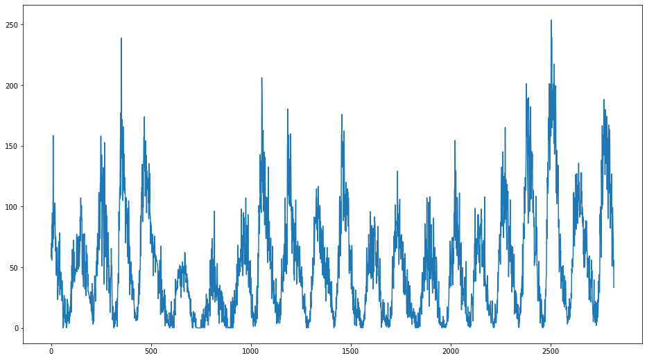
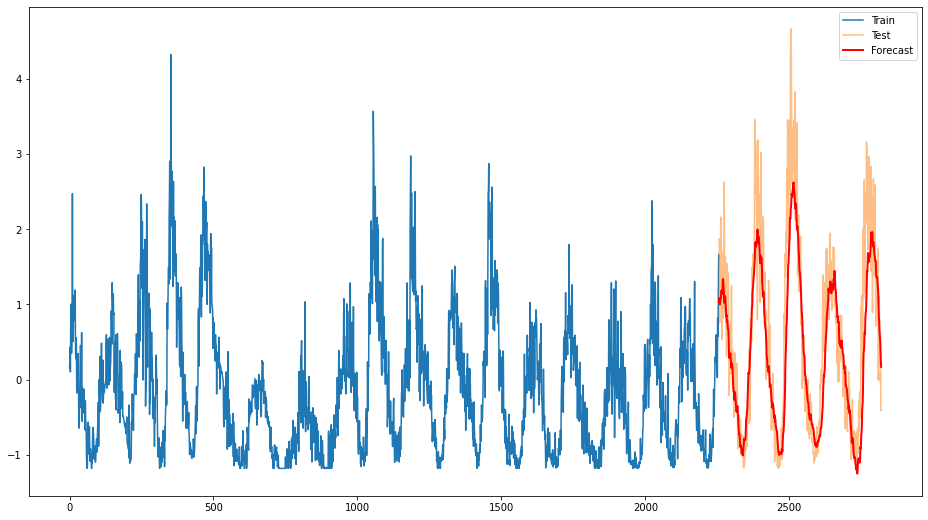

 # Machine learning for time series forecast.

## Data
We will use 2 time series:
1. **Temperature** time series (mean daily temperatures) extracted from Jena Climate dataset;

2. **Sunspots** time series (monthly number of sunspots detected by astronomers).

Temperature time series is very stable, has clear and obvious periodicity and pretty low noise level. Sunspots time series has less obvious periodicity and higher noise levels.

## Results

The obtained forecasts for each time series:
1. **Temperature (ARIMA)**: MAPE = 0.314;

2. **Temperature (LSTM)**: MAPE = 0.437;

3. **Sunspots (ARIMA)**: MAPE = 0.603;

4. **Sunspots (LSTM)**: MAPE = 0.357.

## Conclusions

### Temperature time series
For this time series the LSTM model oversmoothes the forecast and thus forecasts only the general behavior of the time series in the future. The ARIMA model, on the other hand, produces results that are better in terms of MAPE and also in terms of overall more fine-grained day-to-day predictions. It is worth noting that the ARIMA model is much easier to work with computationally.

### Sunspots time series
For this time series the LSTM model produces much more accurate results than ARIMA. ARIMA could probably have performed better if we could use more sophisticated seasonal component, not the simplest possible (0, 1, 0), but using those with long periods is too computationally prohibitive (my PC could not handle it in any reasonable amount of time, the calculations seem to run forever).